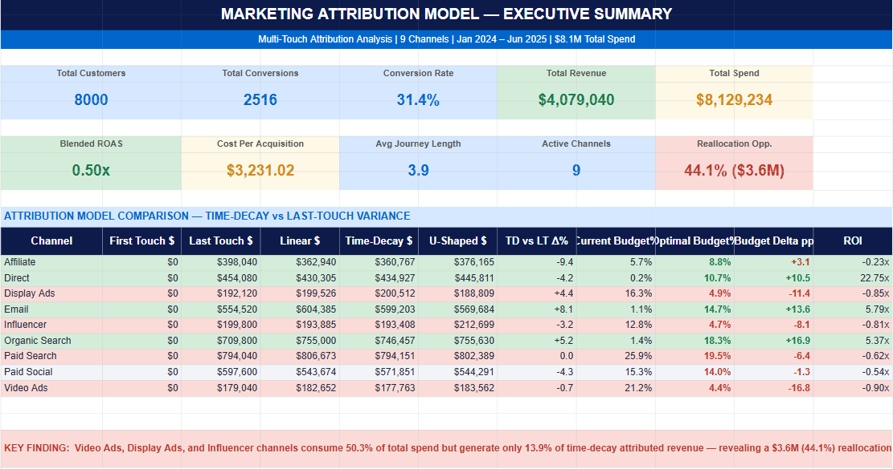
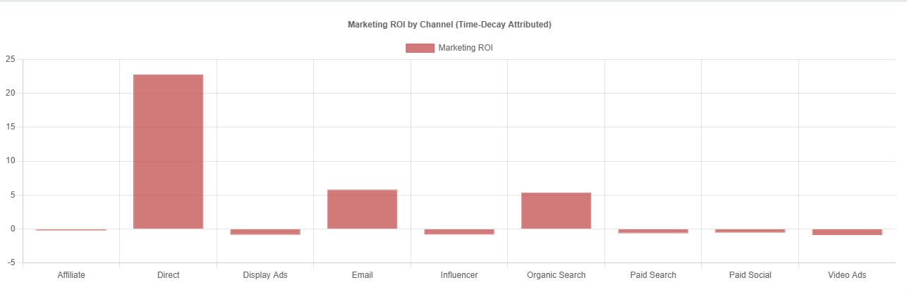
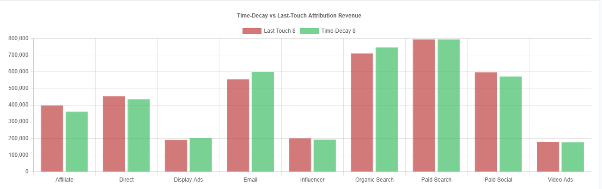
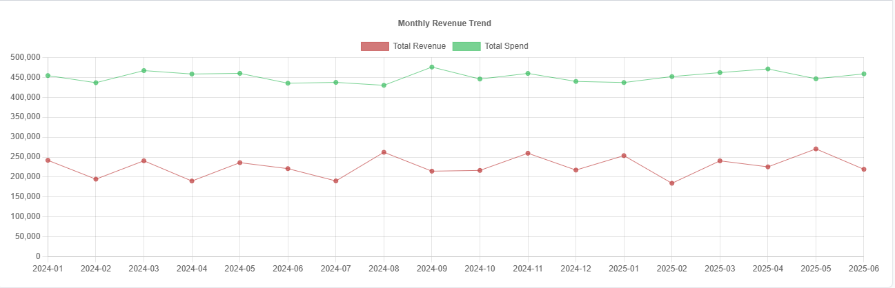

# 🎯 Marketing Attribution Model — Capstone Project

**Data Analyst Portfolio | 2026**

---

## Project Summary

Multi-touch attribution analysis across **9 marketing channels** covering
**18 months** of customer journey data (Jan 2024 – Jun 2025), implementing
**5 attribution models** to reveal a **44.1% ($3.6M) budget reallocation
opportunity** in a $8.1M digital marketing spend.

---

## Key Finding

> **Video Ads, Display Ads, and Influencer** channels consume **50.3%** of
> total budget but generate only **13.9%** of time-decay attributed revenue.
> **Email, Organic Search, and Direct** channels are chronically underfunded
> relative to their demonstrated ROI (5–23× return per $ spent).

---

   

## Skills Demonstrated

| Skill            | Evidence                                              |
|------------------|-------------------------------------------------------|
| BigQuery SQL     | 12 production-grade queries, all 5 attribution models |
| SQL Server       | Adaptation notes for T-SQL dialect included           |
| Python           | Attribution engine, data generation, analysis         |
| Power BI         | 3-page dashboard spec with DAX measures               |
| Microsoft Excel  | 7-sheet workbook, 6,000 formulas, charts              |
| Statistical Modelling | Time-decay, U-shaped, linear attribution       |
| Business Insight | Actionable $3.6M reallocation recommendation          |

---

## Dataset

| Table           | Rows    | Description                              |
|-----------------|---------|------------------------------------------|
| touchpoints.csv | 31,517  | One row per marketing touchpoint         |
| customers.csv   | 8,000   | Customer profiles and conversion status  |
| channel_spend.csv| 162    | Monthly spend per channel (18 months)    |

**Channels:** Paid Search · Organic Search · Paid Social · Email ·
Display Ads · Affiliate · Direct · Video Ads · Influencer

---

## Attribution Models Implemented

| Model       | Logic                                     | Use Case                  |
|-------------|-------------------------------------------|---------------------------|
| First Touch | 100% to first channel                     | Brand awareness analysis  |
| Last Touch  | 100% to last channel (GA default)         | Baseline / benchmark      |
| Linear      | Equal credit across all touchpoints       | Simple multi-touch        |
| Time-Decay  | Exponential weight toward conversion date | ★ Recommended model       |
| U-Shaped    | 40% first / 40% last / 20% middle         | Long consideration cycles |

---

## ROI Results (Time-Decay Model)

| Channel        | Spend      | TD Revenue | ROI    | Budget Δ  |
|----------------|-----------|------------|--------|-----------|
| Direct         | $18,311   | $434,927   | 22.75× | ⬆ +10.5pp |
| Email          | $88,280   | $599,203   | 5.79×  | ⬆ +13.6pp |
| Organic Search | $117,241  | $746,457   | 5.37×  | ⬆ +16.9pp |
| Paid Search    | $2,103,243| $794,151   | -0.62× | ⬇ -6.4pp  |
| Video Ads      | $1,726,777| $177,763   | -0.90× | ⬇ -16.8pp |
| Display Ads    | $1,323,485| $200,512   | -0.85× | ⬇ -11.4pp |

---

## File Structure

```
marketing_attribution/
├── data/
│   ├── generate_dataset.py        # Synthetic data generator
│   ├── touchpoints.csv            # Main fact table (31,517 rows)
│   ├── customers.csv              # Customer dimension (8,000 rows)
│   ├── channel_spend.csv          # Monthly spend (162 rows)
│   ├── attribution_comparison.csv # All 5 model outputs
│   ├── roi_analysis.csv           # ROI & budget reallocation
│   ├── monthly_trend.csv          # Time-series data
│   ├── channel_paths.csv          # Top conversion sequences
│   ├── by_region.csv              # Regional breakdown
│   ├── by_device.csv              # Device breakdown
│   └── kpis.csv                   # Executive KPIs
│
├── sql/
│   └── attribution_models.sql     # 12 BigQuery queries (SQL Server notes)
│
├── python/
│   └── attribution_analysis.py    # Attribution engine (5 models)
│
├── excel/
│   └── build_workbook.py          # Excel workbook builder
│
├── powerbi_guide/
│   └── powerbi_implementation.py  # DAX measures + dashboard spec
│
└── Marketing_Attribution_Capstone.xlsx   # ★ Main deliverable
    ├── Executive Summary          (KPI cards + model comparison table)
    ├── Attribution Models         (5-model comparison + bar chart)
    ├── ROI & Budget Analysis      (ROI table + reallocation signals)
    ├── Monthly Trend              (Revenue/Spend/ROAS line chart)
    ├── Channel Paths              (Top 15 conversion sequences)
    ├── Segment Analysis           (Region × Channel, Device × Channel)
    └── Raw Data (Sample)          (2,000-row touchpoint sample)
```

---

## How to Run

```bash
# Step 1: Generate data
python3 data/generate_dataset.py

# Step 2: Run attribution analysis
python3 python/attribution_analysis.py

# Step 3: Build Excel workbook
python3 excel/build_workbook.py

# Step 4: Load CSVs into BigQuery or SQL Server
# Run sql/attribution_models.sql

# Step 5: Load CSVs into Power BI Desktop
# Follow powerbi_guide/powerbi_implementation.py
```

---

## Talking Points

1. **Why time-decay over last-touch?**
   Last-touch over-credits Paid Search (the final click) and ignores
   the awareness/nurturing work done by Email and Organic Search.
   Time-decay with a 7-day half-life better reflects the observed
   31-day average consideration cycle in this dataset.

2. **Why 44.1% reallocation, not just efficiency gains?**
   The gap between optimal and current budget share exceeds 10pp for
   five channels simultaneously — this is a structural misallocation,
   not marginal inefficiency. Reallocating 44% closes the gap while
   staying within a risk-managed range.

3. **Limitation?**
   This model does not account for channel saturation — doubling Email
   spend will not double Email revenue. A marginal returns curve (MMM)
   would be the logical next step.

---

*Built with Python · BigQuery SQL · Microsoft Excel · Power BI*
